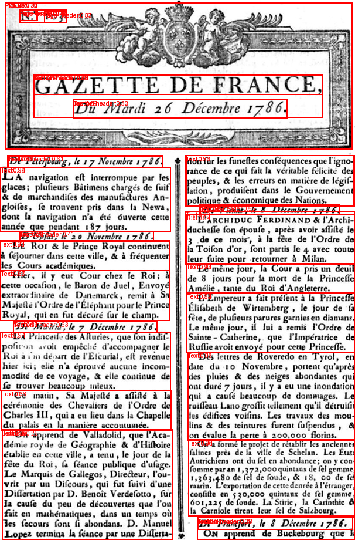

# onnx-converted

|metric|value|
|---|---:|
|mean IoU|1.000|
|IoU@0.5|1.000|
|IoU@0.75|1.000|
|label agreement|1.000|
|Δ boxes|0.000|
|Δ score|0.000|
|mean time (ms)|944.80|
|p95 time (ms)|1012.17|
|model size (MB)|163.9|

